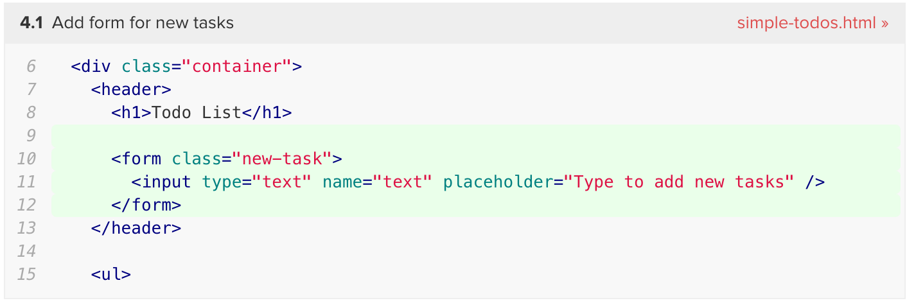

<h1>Code snippet box for tutorials</h1>

To display Git patches parsed by `mdg:tutorial-step-diff-compiler` in a nice code box, use the `mdg:tutorial-diff-box` package.

```sh
meteor add mdg:tutorial-diff-box
```


### Features



The code box currently displays:

1. The step number and commit message in the top left
2. Filename and link to GitHub in the top right
3. Code with gray background for context and green background for changed/added lines, code highlighted based on the file extension of the file

### Usage

This assumes you have already done the steps to set up the [patch build plugin](tutorial-step-diff-compiler.md).

In your client-side JavaScript code, register a tutorial:

```js
DiffBox.registerTutorial("simple-todos", {
  gitHubRepoName: "meteor/simple-todos",
  patchFilename: "simple-todos.multi.patch"
});
```

This is used to generate the links to GitHub, and reduce the amount of boilerplate by defining a short name like "react" instead of "react.multi.patch".

Now you should be able to use diff boxes in your Spacebars templates:

```html
{{> DiffBox tutorialName="simple-todos" step="4.1"}}
```
